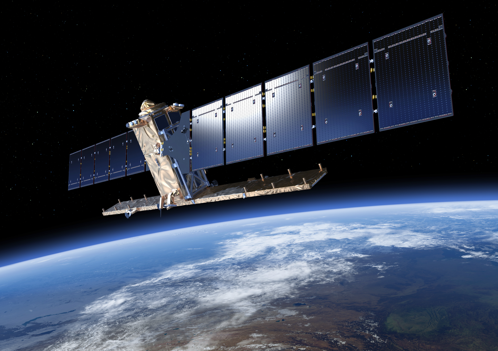
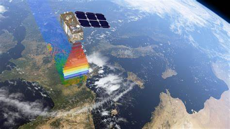
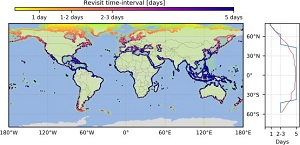

# Week2 Sentinel
```{r xaringan-themer, include=FALSE, warning=FALSE}
library(xaringanthemer)
style_mono_accent(
  base_color = "#1c5253",
  header_font_google = google_font("Josefin Sans"),
  text_font_google   = google_font("Montserrat", "300", "300i"),
  code_font_google   = google_font("Fira Mono")
)
```
# Summary
# Application
# Reflection
# Reference
---
# Summary
- Sentine l
- Sentine 2
---
# Sentinel 1

.pull-left[
  The Sentinels are the satellites of European Space Agency (ESA), designed to deliver a vast amount of data and imagery for Europe’s Copernicus program.The Sentinels are the satellites of European Space Agency (ESA), designed to deliver a vast amount of data and imagery for Europe’s Copernicus program.The Sentinel-1 Mission Guide contributes a detailed description of the satellite type itself, mission goals, Ground Segment. It also presents heritage missions, thematic areas, orbit characteristics and coverage along with instrument payload.
]
.pull-right[
```{r echo=FALSE, out.width='80%', fig.align='center'}

```
]
---

# Sentinel 2

.pull-left[
 SENTINEL-2, launched as part of the European Commission’s Copernicus program on June 23, 2015, was designed specifically to deliver a wealth of data and imagery. The satellite is equipped with an opto-electronic multispectral sensor for surveying with a sentinel-2 resolution of 10 to 60 m in the visible, near infrared (VNIR), and short-wave infrared (SWIR) spectral zones, including 13 spectral channels, which ensures the capture of differences in vegetation state, including temporal changes, and also minimizes impact on the quality of atmospheric photography.
]
.pull-right[
```{r echo=FALSE, out.width='100%', fig.align='center'}

```
]

---
# Application

- 1 Sentinel-1 backscatter temporal variations are compared with optical-derived NDVI
[[Source](https://www-sciencedirect-com.libproxy.ucl.ac.uk/science/article/pii/S0034425717303309)]
- 2 Coastal coverage of ESA’ Sentinel 2 mission[(Bergsma and Almar, 2020)](https://www-sciencedirect-com.libproxy.ucl.ac.uk/science/article/pii/S027311772030140X)</br>

This paper discusses the ability of the Sentinel 2 constellation to cover coastal areas and measure coastal processes - both physical and biological. The study shows that Sentinel 2 is capable of **making high-frequency measurements on a global scale**. Cloud coverage at high latitudes is overcome by reduced revisit intervals. Around the equator only, the longest revisit intervals and high cloud probabilities limit coastal measurements there. The Sentinel 2-based method is able to **estimate digital elevation models for mid- and high-latitude coastal areas and sporadic points at low latitudes** where the 2 orbital strips overlap. This works also shows that Sentinel 2 enables coastal monitoring as never before, large spatial scale with revisits of a few days at most of the world.</br>


---
# Reflection

During the week, I gained a comprehensive understanding of remote sensing data, especially the Sentinel series. I learnt a lot about Sentinel satellites such as Sentinel-1， which provides all-weather, day and night radar imagery for land and ocean monitoring, emergency response and maritime security.Sentinel-2，which provides high-resolution optical images of the Earth's land surface that can be used to monitor changes in vegetation, land cover and water quality. Sentinel satellites can also provide information on atmospheric conditions, ocean Sentinel satellites can also provide timely and accurate data on environmental parameters such as atmospheric conditions, ocean parameters and land use, but the sensors on Sentinel satellites are designed to capture data in a specific wavelength range, which may limit their ability to capture information on certain environmental parameters.


---
# Reference

Bergsma, E.W.J., Almar, R., 2020. Coastal coverage of ESA’ Sentinel 2 mission. Adv. Space Res. 65, 2636–2644. https://doi.org/10.1016/j.asr.2020.03.001


---

class: center, middle

# Thanks!

